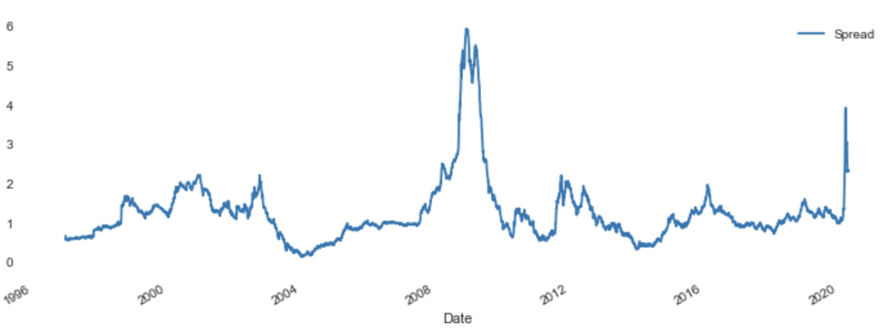
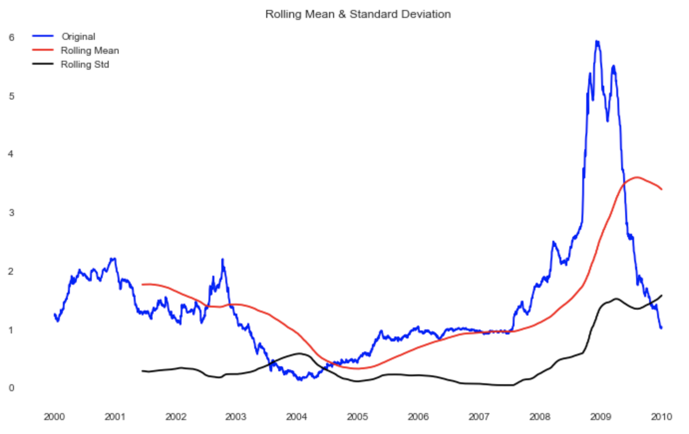
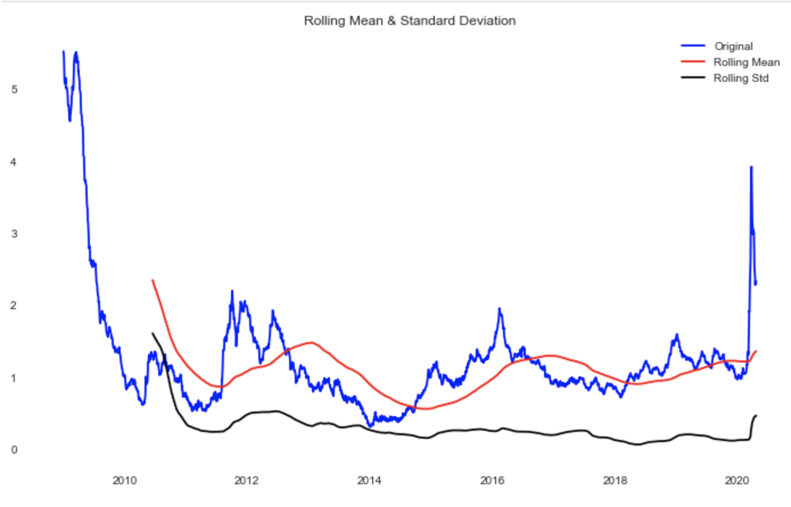
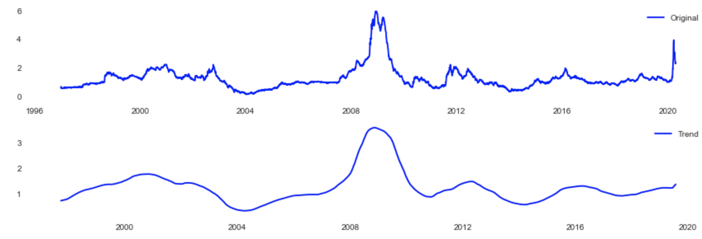
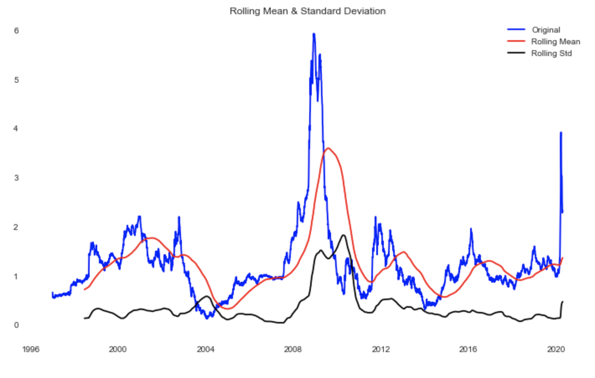
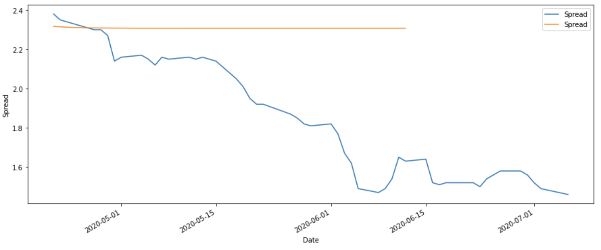
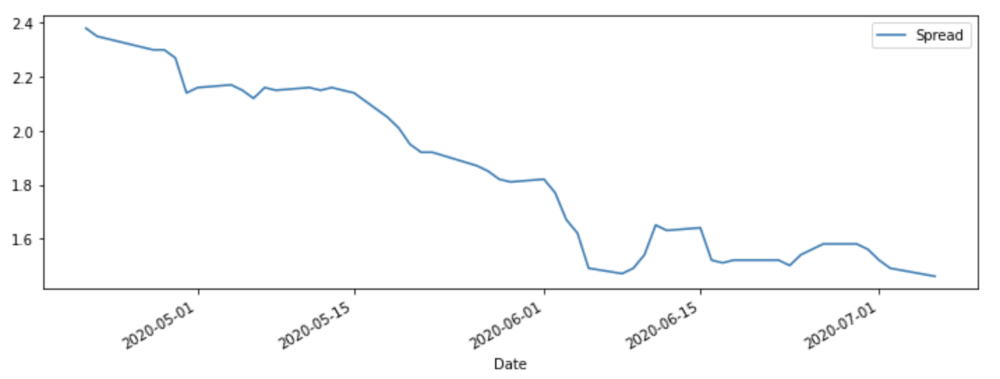

# Spread_Series

 

Looking at the historical spread between the U.S. Corporate Bond Index Effective Yield (BAMLC0A0CMEY) and the U.S. 10 year treasury. 

 

Given the historical 10 year U.S. treasury rate (going back to '96) and the yield on BAML's US Corporate Bond Index, what can we learn from the history of the spread between the two, and how can we model the spread for future periods?

 

The data begins from 12-31-1996, the first date on the corporate bond index, and runs through 4-20-2020. An in-sample test was done to measure the effectiveness of the model, ranging from 1-02-2020 through 4-20-2020. An out-of-sample test was then run, ranging from 4-21-2020 through 7-06-2020, to measure the model's real world application.

## Historical Context

 

Given the historical data, we can see that during the last two recessions (early 2000s, GFC), and the first several months of the COVID pandemic, the spread spiked, displayed volatility, and then quickly decreased. In response to the crash of the tech bubble, the Fed lowered the fed funds rate in order to stimlate the economy. In response to the 2008 and COVID recessions, the fed implemented quantitative easing/stimulation to try to keep the economy running. 

[Spread through 4-20-2020]

We can see that the GFC displayed a significantly higher spread, as expected. This was followed by a historically high percentage of defaults. As corporates were sold off and money pushed into Treasuries for both safety and as a result of quantitative easing, the spread widened, conveying the riskiness of the market at the time. The GFC saw a higher number of defaults as a result of over-leveraging and liquidity issues, experienced by both borrowers and investors. 

[Spread movement during the GFC]

In the first half of 2020, the spread spiked as the economy was shut down, resulting in a large market sell-off, and a flight to safety by investors. The shut-down caused major concerns for corporates, many of whom are expected to default. During this period the spread spiked but never crossed 4.0, reaching 'only' as high as 3.92, and began decreasing quickly as quantitative easing and stimulation measures took effect. Although the yield on the corporate bond index spiked, it doesn't show the full impact to corporates. BAML's Corporate Bond Index is made up of investment grade securities. During the pandemic, there was a large number of investment grade issuers who were downgraded to below investment grade, so called 'fallen angels'. Although the yields on these corporates rise in response to their increased riskiness, these same corporates are dropped from the investment grade index.

 

[Rolling statistics since the GFC]

 

## What affects the spread?

The spread can be viewed as a certain measure of riskiness. A narrower spread indicates lower corporate yields, or higher Treasury yields, resulting from stronger borrowers and investor demand. As corporate bonds begin to appear riskier on a large scale, often as part of a larger economic downturn, they are sold off by investors, who then put their capital into treasuries or cash instruments. 

[Trend vs Actual]

 

## Modeling current and future periods
 
AR, ARMA, SARIMAX, and FB Prophet models were run. However, SARIMAX produced the best results in terms of MSE. Although the model worked well for the in-sample test, it worked poorly on the out-of-sample, real-world data. The forecast predicted very minimal changes, decreasing by only .02 in the first two months. The model was unable to pick on the rate of decrease.

 

## What does the spread tell us?
 
Unfortunately, the model was unable to produce meaningful results. This may indicate the inability or the difficulty of the spread to be accurately modeled, or a need for a more robust model. However, by simply looking at the history of the spread and the periods following higher than usualy levels, insight can be gained into the future movement of the spread and the riskiness of the credit market. 

Following these spikes in the spread, levels quickly decreased, but were then followed by smaller spikes and increased volatility. We can also see that while the pandemic caused a spike in the spread, looking at the rolling mean shows that both the 2000 and 2008 crashes had higher means than the current level. This can be useful as the credit markets look to deal with the continued effects of the pandemic and its (socio)economic impact. 

[![Rolling statistics through 4-20-2020]

 

## How can we improve the model?
 
The model was run on the actual spread between the two components. Modeling the components individually and then taking the spread may produce more accurate results. Modeling the spread by month may also produce a higher level of accuracy as it picks up on a broader trend, but would have less data points to work with.

[53 day forecast]

 

[Actual Spread]

Note - In regards to the multiple testing problem, while there were multiple tests performed, the test with the best MSE still performed poorly on real-world data. As a result, the remaining models weren't mentioned. Their results are available for exploration in the notebooks.

 
